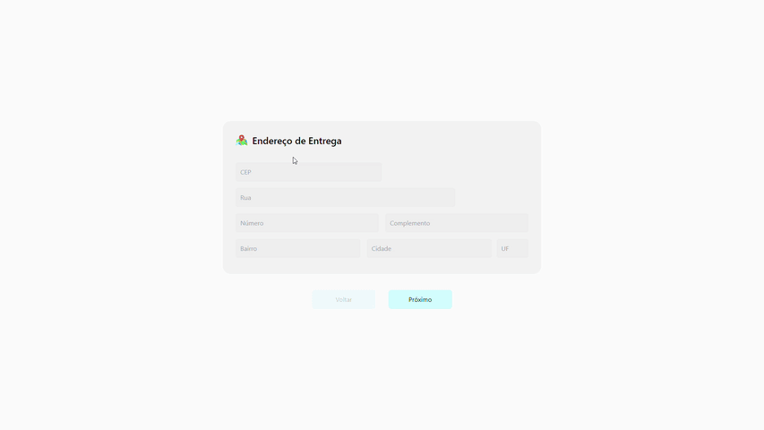

<h1 align="center">SLIDER DE PAGAMENTO</h1>

> 🔎 Funcionalidade de Slider de pagamento onde informamos dados de endereço e pagamento.  
🗔 Confira a aplicação: https://landing-page-reactjs-26cc5lv3m-klausmorotti.vercel.app/  

## 📄 Explicação
Hoje em dia fazemos diversos pedidos de forma delivery onde é entregue em nossa residência e não temos como fugir do pagamento não é mesmo? rsrs, então vamos torna-lo mais dinâmico e bonito com o slider pelo aplicativo.

O projeto foi desenvolvido com ReactJS e estilizado com as bibliotecas Styled Components e TailwindCSS.
Nela tive diversos desafios como aplicar o conceito de Redux para compartilhamento de dados com outros componentes e aplicar a responsividade no Slider.
Também pude aprimorar meus padrões de organização aplicando a componentização e consequentemente tornando um código legível e de fácil manutenção.

## 📁 Páginas

O site tem no total 1 página, sendo ela

- **Página principal:** O Slider principal com as fases do pagamento.

## 🎯 Etapas 

:heavy_check_mark: Criar projeto com Vite.  
:heavy_check_mark: Instalando Styled Components e TailwindCSS.  
:heavy_check_mark: Desenvolvendo a página e estilizando com Styled Components e TailwindCSS.  
:heavy_check_mark: Aplicando a lógica de slider para a passagem dos slides ao clicar no bos botões.  
:heavy_check_mark: Criando a verificação de preenchimento de todos os campos.  
:heavy_check_mark: Criando a verificação de método de pagamento selecionado.  
:heavy_check_mark: Aplicando verificação para alterar valor dos botões.  
:heavy_check_mark: Instalando e utilizando Redux para compartilhamento de informações com os demais componentes.  
:heavy_check_mark: Tornando a página responsiva.  
:heavy_check_mark: Projeto finalizado.  

## 🚀 Tecnologias 

- [ReactJS](https://pt-br.reactjs.org/)
- [Styled Components](https://styled-components.com/)
- [TailwindCSS](https://tailwindcss.com/)
- [Redux](https://redux.js.org/)

## 🤝 Colaboradores

Agradecemos às seguintes pessoas que contribuíram para este projeto:

<table>
  <tr>
    <td align="center">
      <a href="#">
         
        
          <b>Klaus Morotti</b>
        
      </a>
    </td>
  </tr>
</table>

## 📝 Licença

Este projeto está sob licença. Consulte o arquivo <a href="https://github.com/klausmorotti/slider-payment/blob/master/LICENSE">LICENSE</a> para obter mais detalhes.

<a href="#top">Volte para o topo</a>
